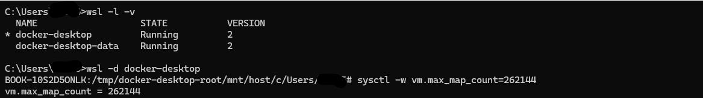
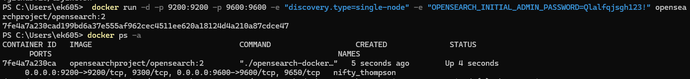
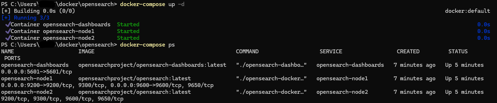
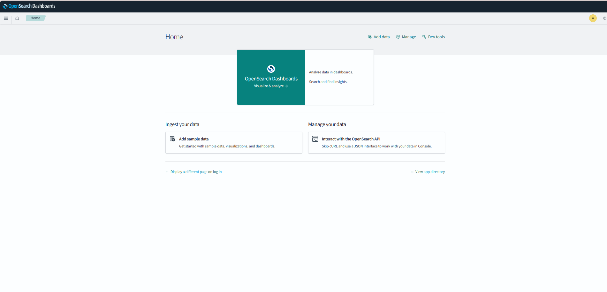

# Docker로 OpenSearch 설치하기.md

### **Configure important host settings**

도커를 사용하여 OpenSearch 를 설치하기 전에 아래와 같은 설정을 구성한다. 이 설정은 서비스의 성능에 영향을 미칠 수 있는 가장 중요한 설정이다.

**Windows 설정**

도커 데스트톱을 통해 WSL을 사용하는 윈도우즈 워크로드의 경우 터미널에서 다음 명령을 실행하여 `vm.nax_map_count`를 설정한다.

```bash
wsl -d docker-desktop
## WSL을 사용하여 Docker Desktop 가상 머신으로 들어가는 것을 의미

sysctl -w vm.max_map_count=262144
## 가상 머신의 커널 매개변수인 vm.max_map_count 값을 262144로 설정
## Elasticsearch는 가상 메모리 매핑(mapping)을 위해 많은 수의 매핑을 요구할 수 있으므로, 이를 충족시키기 위해 vm.max_map_count 값을 증가시키는 것이 필요할 수 있다
```



### **Run OpenSearch in a Docker container**

공식 OpenSearch 이미지는 Docker Hub 및 Amazon ECR에서 호스팅 되며, 이미지를 검사하려면 아래와 같이 `docker pull` 명령어를 사용하여 개별적으로 풀링 할 수 있다.

```bash
docker pull opensearchproject/opensearch:2

docker pull opensearchproject/opensearch-dashboards:2
```

OpenSearch 를 단일 컨테이너에 배포하여 Docker가 올바르게 작동하는지 확인해야 한다.

1. docker container 실행
    
    이때 비밀번호는 8자 이상의 암호이다. 대문자, 소문자, 숫자 및 강한 특수 문자를 하나 이상 포함해야 한다.
    
    ```bash
    docker run -d -p 9200:9200 -p 9600:9600 -e "discovery.type=single-node" -e "OPENSEARCH_INITIAL_ADMIN_PASSWORD=<custom-admin-password>" opensearchproject/opensearch:latest
    ```
    
        
    
2. 포트 9200으로 요청을 보낸 후 응답 확인
    
    Qlalfqjsgh123!
    
    ```bash
    curl https://localhost:9200 -ku 'admin:<custom-admin-password>'
    ```
    
3. 실행 중인 컨테이너 중지
    
    ```bash
    docker stop <containerId>
    ```
    

### **Deploy an OpenSearch cluster using Docker Compose**

한 번에 하나의 명령어로 컨테이너를 만들어 OpenSearch 클러스터를 구축하는 것은 기술적으로 가능하지만 yaml 파일에서 환경을 정의하고 docker compose 으로 클러스터를 관리하도록 하는 것이 더 쉽다. 

아래 yml 파일은 OpenSearch 서비스를 실행하는 두 개의 컨테이너와 OpenSearch Dashboards를 실행하는 단일 컨테이너의 세 가지 컨테이너를 포함하는 클러스터를 생성한다. 이 컨테이너들은 OpenSearch-net 이라는 브리지 네트워크를 통해 통신하려 각 OpenSearch 노드에 대해 하나씩 두 개의 볼륨을 사용한다. (이 yml 파일은 데모 보안 구성을 명시적으로 비활성화하지 않으므로 자체 서명 TLS 인증서가 설치되고 기본 이름과 암호를 가진 내부 사용자가 생성된다.

**docker-compose.yml**

```bash
version: '3'
services:
  opensearch-node1: # This is also the hostname of the container within the Docker network (i.e. https://opensearch-node1/)
    image: opensearchproject/opensearch:latest # Specifying the latest available image - modify if you want a specific version
    container_name: opensearch-node1
    environment:
      - cluster.name=opensearch-cluster # Name the cluster
      - node.name=opensearch-node1 # Name the node that will run in this container
      - discovery.seed_hosts=opensearch-node1,opensearch-node2 # Nodes to look for when discovering the cluster
      - cluster.initial_cluster_manager_nodes=opensearch-node1,opensearch-node2 # Nodes eligible to serve as cluster manager
      - bootstrap.memory_lock=true # Disable JVM heap memory swapping
      - "OPENSEARCH_JAVA_OPTS=-Xms512m -Xmx512m" # Set min and max JVM heap sizes to at least 50% of system RAM
      - "DISABLE_INSTALL_DEMO_CONFIG=true" # Prevents execution of bundled demo script which installs demo certificates and security configurations to OpenSearch
      - "DISABLE_SECURITY_PLUGIN=true" # Disables Security plugin
    ulimits:
      memlock:
        soft: -1 # Set memlock to unlimited (no soft or hard limit)
        hard: -1
      nofile:
        soft: 65536 # Maximum number of open files for the opensearch user - set to at least 65536
        hard: 65536
    volumes:
      - opensearch-data1:/usr/share/opensearch/data # Creates volume called opensearch-data1 and mounts it to the container
    ports:
      - 9200:9200 # REST API
      - 9600:9600 # Performance Analyzer
    networks:
      - opensearch-net # All of the containers will join the same Docker bridge network
  opensearch-node2:
    image: opensearchproject/opensearch:latest # This should be the same image used for opensearch-node1 to avoid issues
    container_name: opensearch-node2
    environment:
      - cluster.name=opensearch-cluster
      - node.name=opensearch-node2
      - discovery.seed_hosts=opensearch-node1,opensearch-node2
      - cluster.initial_cluster_manager_nodes=opensearch-node1,opensearch-node2
      - bootstrap.memory_lock=true
      - "OPENSEARCH_JAVA_OPTS=-Xms512m -Xmx512m"
      - "DISABLE_INSTALL_DEMO_CONFIG=true" # Prevents execution of bundled demo script which installs demo certificates and security configurations to OpenSearch
      - "DISABLE_SECURITY_PLUGIN=true" # Disables Security plugin
    ulimits:
      memlock:
        soft: -1
        hard: -1
      nofile:
        soft: 65536
        hard: 65536
    volumes:
      - opensearch-data2:/usr/share/opensearch/data
    networks:
      - opensearch-net
  opensearch-dashboards:
    image: opensearchproject/opensearch-dashboards:latest # Make sure the version of opensearch-dashboards matches the version of opensearch installed on other nodes
    container_name: opensearch-dashboards
    ports:
      - 5601:5601 # Map host port 5601 to container port 5601
    expose:
      - "5601" # Expose port 5601 for web access to OpenSearch Dashboards
    environment:
      - 'OPENSEARCH_HOSTS=["http://opensearch-node1:9200","http://opensearch-node2:9200"]'
      - "DISABLE_SECURITY_DASHBOARDS_PLUGIN=true" # disables security dashboards plugin in OpenSearch Dashboards
    networks:
      - opensearch-net

volumes:
  opensearch-data1:
  opensearch-data2:

networks:
  opensearch-net:
```

docker-compose 명령어를 사용해서 컨테이너를 생성하고 실행한다. 

```bash
docker-compose up -d
```

컨테이너가 올바르게 실행되었는지 확인한다.

```bash
docker-compose ps
```



브라우저에서 http://localhost:5601 에 접속하여 OpenSearch Dashboard에 접속 되는지 확인한다. 기본 사용자 이름은 admin이고 비밀번호는 docker-compose에 설정한 비밀번호를 입력하면 된다



출처: [Docker](https://opensearch.org/docs/latest/install-and-configure/install-opensearch/docker/)
